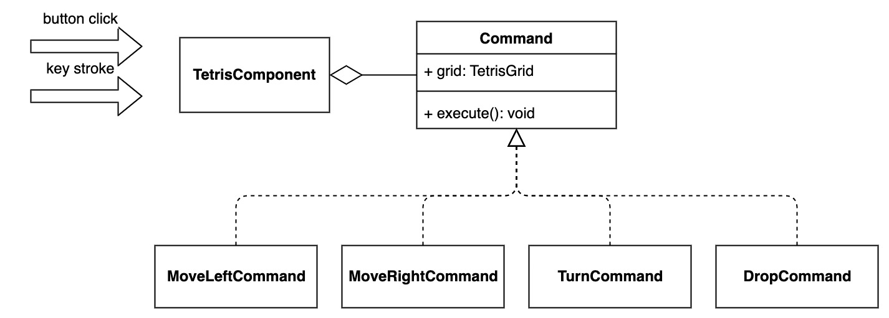

# Introduction

command design pattern

# Code Design
The current code works fine in completing the game logic. The game model is elegantly and briefly implemented. The 
user uses minimum code to hold several kinds of combinations of tetris game. However, the handling of events is 
poorly encapsulated and in the context of adding another kind of event which does the same things with the prior 
ones, the user has to repeat the same logics, which means he will have to copy the whole if else or switch snippet 
into the new event handler. When he wants to add something into one kind of event, such as making some changes to 
the panel that displays the next tetris block, he will have to add the same logic in both event handlers, which 
causes code repeating and is prone to errors and inconsistency.

# Feature Extension
My method to add new feature is first encapsulate the keystrokes' responses into commands. Command is an interface 
which has a single method execute. It has four implementations which is moving left, moving right, turning, and 
dropping respectively. The tetris component instance will have a hash map which has key of string and value of 
Command instance. The handling of moving left, etc. is encapsulated into Command instances, and the event handlers 
are changed to execute the command in the map. In such way, the modularity is intensified and also the extensibility 
because if the user want to make more effects in the moving left event, he will only have make changes to 
MoveLeftCommand and the difference is reflected in every event handlers. If he wants to add new event handlers he 
will have to write new instance. 

After encapsulating the commands the user will simply add four buttons in the tetris component and set its event 
handler to execute its respective command, and do not forget to change the original event handler for keystrokes.

# Impact
The features of adding control buttons will be inserted into the code elegantly. There is no need of worrying about 
when adding a new feature in response to an event without adding for another event, so the risks of such kinds of 
errors is lowered. Whenever the user want to add another new feature, he will just have to implement the Command 
Interface and add it to the table, and execute the command in response to target events. Needless to say, the 
execution of user evenet is encapsulated into separate objects, its modularity is also intensified.

# Conclusion

# Reference

None
